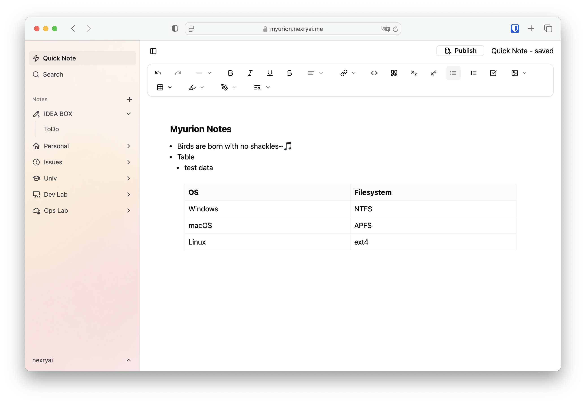
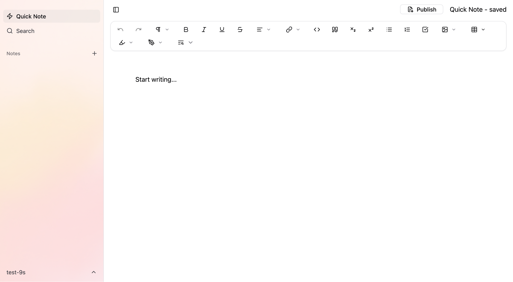

# Myurion Notes
Modern, lightweight, self-hosted Note Taking App

  
Myurion is a modern, lightweight note taking app with a WYSIWYG editor, written in TypeScript and Svelte.
It is designed and optimized for single-person use, uses SQLite as its database, and is lightweight enough to run on Google Compute Engine's e2-micro.
This project is a work in progress and lacks many needed features. Please do not use it for anything other than testing.

### Screenshots

